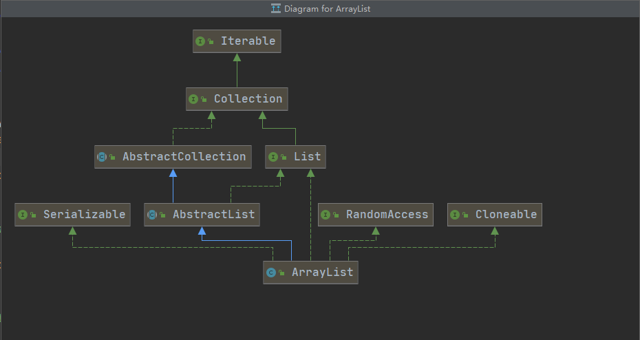

# ArrayList源码分析

## 类关系图谱



## 构造函数

- **ArrayList(int)**

```java
public ArrayList(int initialCapacity) { // 传入初始容量大小
    if (initialCapacity > 0) {
        this.elementData = new Object[initialCapacity]; // 创建存储ArrayList的元素的数组缓冲区
    } else if (initialCapacity == 0) {
        // 如果容量为0则使用'EMPTY_ELEMENTDATA'  字段声明如下
        /**
		 *  //Shared empty array instance used for empty instances.
    	 *  private static final Object[] EMPTY_ELEMENTDATA = {};
         */this.elementData = EMPTY_ELEMENTDATA; 
    } else {
        // 容量不可为负数
        throw new IllegalArgumentException("Illegal Capacity: "+
                                           initialCapacity);
    }
}
```

- **ArrayList()**

```java
public ArrayList() {
	// 默认容量为10 
    this.elementData = DEFAULTCAPACITY_EMPTY_ELEMENTDATA;
}
```

- **ArrayList(Collection<? extends E>)**

```java
public ArrayList(Collection<? extends E> c) {
    elementData = c.toArray();
    if ((size = elementData.length) != 0) {
        // defend against c.toArray (incorrectly) not returning Object[]
        // (see e.g. https://bugs.openjdk.java.net/browse/JDK-6260652)
        if (elementData.getClass() != Object[].class)
            elementData = Arrays.copyOf(elementData, size, Object[].class);
    } else {
        // replace with empty array.
        this.elementData = EMPTY_ELEMENTDATA;
    }
}
```


## 关键函数

- **newCapacity(int)**

```java
/**
 * 返回至少一个容量大到给定的最小容量。 返回当前容量增加如果就足够了50％。 不会返回的容量大于
 * MAX_ARRAY_SIZE除非给定的最小容量大于MAX_ARRAY_SIZE更大。
 *
 */
private int newCapacity(int minCapacity) {
    // overflow-conscious code
    // 记录缓冲区的长度
    int oldCapacity = elementData.length;
    // 扩容后的长度 为原长度的150% (原长度+原长度*50%)
    int newCapacity = oldCapacity + (oldCapacity >> 1);
    if (newCapacity - minCapacity <= 0) {
        if (elementData == DEFAULTCAPACITY_EMPTY_ELEMENTDATA)
            return Math.max(DEFAULT_CAPACITY, minCapacity);
        if (minCapacity < 0) // overflow
            throw new OutOfMemoryError();
        return minCapacity;
    }
    return (newCapacity - MAX_ARRAY_SIZE <= 0)
        ? newCapacity
        : hugeCapacity(minCapacity);
}
```

- **get(int)**

```java
public E get(int index) {
    Objects.checkIndex(index, size); // 检查index是否越界，越界就抛出IndexOutOfBoundsException
    return elementData(index); // 返回对应位置上的数据
}
```

- **set(int,E)**

```java
public E set(int index, E element) {
    Objects.checkIndex(index, size); // 检查index是否越界，越界就抛出IndexOutOfBoundsException
    E oldValue = elementData(index); // 记录原有的数据
    elementData[index] = element; // 替换数据
    return oldValue; // 返回旧数据
}
```

- **add(e,Object,int)**

```java
private void add(E e, Object[] elementData, int s) {
    if (s == elementData.length) // 判断是否达存储上限
        elementData = grow(); // 扩容
    elementData[s] = e; // 存值
    size = s + 1; // 长度+1
}
```

- **remove(int)**

```java
public E remove(int index) {
    Objects.checkIndex(index, size); // 检查下标
    final Object[] es = elementData; 
    @SuppressWarnings("unchecked") E oldValue = (E) es[index]; // 记录旧值
    fastRemove(es, index); // 移除
    return oldValue; 
}
```

## 类解读

ArrayList每次扩容均扩大为原容量的150%，这一点可由**newCapacity(int)**函数知悉。

ArrayList 采用动态数组对象实现，随机读写速度非常快。

ArrayList为非线程安全的，在对数据进行修改的时候没有使用synchronized来加同步锁保证数据互斥同步。

ArrayList 使用父类的AbstractList中的modCount属来进行记录数据修改的次数，如果在多线程中修改导致当前modCount和类记录的modCount不同，则报ConcurrentModificationException并发修改异常。上述内容在` forEach(Consumer<? super E>) `,` removeIf(....) `, ` replaceAll() ` , ` sort()` 等方法中有进行检查。

