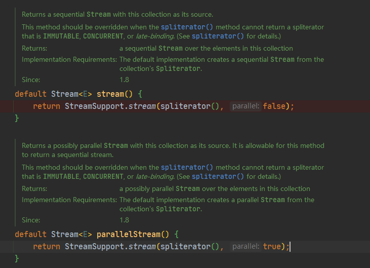
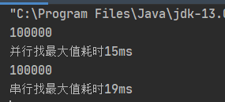

# Collection 中的Stream流引发的思考

前言:

​	在Collection中有二个方法，方法签名如下



两个方法均调用了`public static <T> Stream<T> stream(Spliterator<T> spliterator, boolean parallel)` 该方法根据第二个入参的值来选择是否返回并行的流还是串行的流。

> parallel – if true then the returned stream is a parallel stream; if false the returned stream is a sequential stream.
> 
>parallel –如果为true，则返回的流为并行流；如果为false，则返回的流是顺序流。

这是该参数的文档解释.

**由此引发的思考就此展开。**

上文提到过两个关键词“并行流”和"串行流(顺序流)"，那么什么是并行流，什么是串行流呢？

**并行流**就是把一个内容分成多个数据块，并用不同的线程分别处理每个数据块的流。而**串行流**则是处理整个内容数据。


他们之间最直接的性能表现能有多大呢？

我们用一个代码来展示

```java
package org.example;

import java.util.*;
import java.util.stream.Stream;


/**
 * @author zheng
 */
public class Main {
    public static void main(String[] args) {
        List<Integer> integerList = new ArrayList<>();

        for (int i = 0; i < 100000; i++) {
            integerList.add(i + 1);
        }

        Stream<Integer> sequentialStream = integerList.stream();
        Stream<Integer> parallelStream = integerList.parallelStream();

        Long time = System.currentTimeMillis();
        Stream<Integer> sorted = sequentialStream.sorted((a, b) -> b - a);
        System.out.println(sorted.findFirst().get());
        System.out.println("并行找最大值耗时" + (System.currentTimeMillis() - time) + "ms");

        Long time2 = System.currentTimeMillis();
        Stream<Integer> sorted2 = parallelStream.sorted((a, b) -> b - a);
        System.out.println(sorted2.findFirst().get());
        System.out.println("串行找最大值耗时" + (System.currentTimeMillis() - time2) + "ms");
    }
}
```

运行结果



可以看到使用不同的流模式，最终代码的执行时间也是不一样的。

写道这里并行流和串行流最直观的区别也展现出来了，接下来要做的就是去深扒他的裤子，去深究他为什么可以这么快。

原来是因为在并行流中使用了Fork/Join并发框架

> fork操作的作用是把一个大的问题划分成若干个较小的问题。在这个划分过程一般是递归进行的。直到可以直接进行计算。需要恰当地选取子问题的大小。太大的子问题不利于通过并行方式来提高性能，而太小的子问题则会带来较大的额外开销。每个子问题计算完成后，可以得到关于整个问题的部分解。join操作的作用是把这些分解手机组织起来，得到完整解。
>
> 简单的说，ForkJoin其核心思想就是分治。Fork分解任务，Join收集数据。
>
>  
>
> 一个fork/join框架之下的任务由ForkJoinTask类表示。ForkJoinTask实现了Future接口，可以按照Future接口的方式来使用。在ForkJoinTask类中之重要的两个方法fork和join。fork方法用以一部方式启动任务的执行，join方法则等待任务完成并返回指向结果。在创建自己的任务是，最好不要直接继承自ForkJoinTask类，而要继承自ForkJoinTask类的子类RecurisiveTask或RecurisiveAction类。两种的区别在于RecurisiveTask类表示的任务可以返回结果，而RecurisiveAction类不行。


fork/join 框架简单介绍到此，后期读到源码再进行详细学习记录。