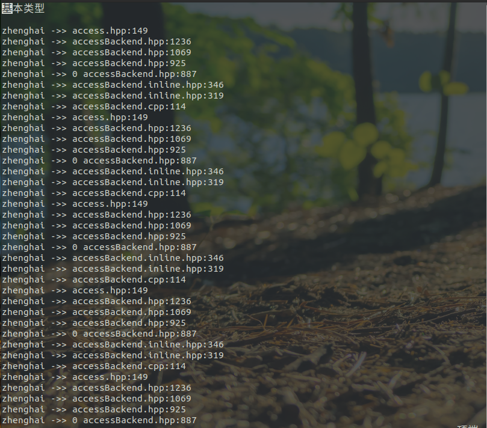
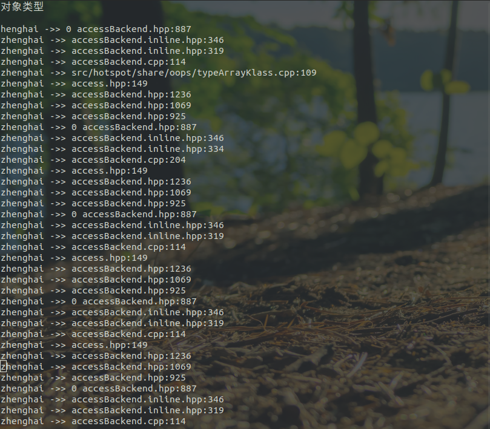
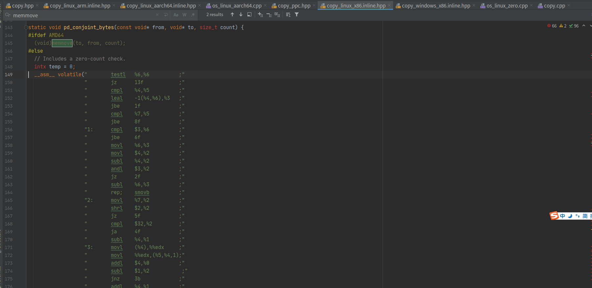

# System类中的一个native方法源代码解读

首先上方法签名

```java
public static native void arraycopy(Object src,  int  srcPos,
                                    Object dest, int destPos,
                                    int length);
```

至于我为什么会关注到这个方法上面来还带从之前看集合框架的源代码说起。在集合框架中对数组进行操作时，都会直接或者间接的调用此方法。网上查资料说此native方法很快，能带来很高的性能提升。那为什么一个数组拷贝的native方法就能带来高性能呢 ？

想要解决这个问题最好的办法就是去看这个方法是怎么实现的。

于是我开始追踪虚拟机的代码执行，就有了下面的内容.......

> 下载源代码，构建JDK编译调试环境 本篇暂不作介绍

## 0x000  测试代码

```java
import java.util.Arrays;

class TestObj {
	private int id;
	
	public TestObj(int id){
		this.id = id;
	}
	
	public String toString(){
		return "Test Object "+this.id;
	}
}

public class Test {

	public static void main(String [] args){

		System.out.println("基本类型\n");
		int arr1[] = {1,2,3,4};
		System.arraycopy(arr1,0,arr1,1,2);
		System.out.println(Arrays.toString(arr1));
		
		System.out.println("对象类型\n");
		TestObj arr2[] = {new TestObj(1),new TestObj(2),new TestObj(3),new TestObj(4)};
		System.arraycopy(arr2,0,arr2,1,2);
		System.out.println(Arrays.toString(arr2));
	}
}
```


## 0x001 定位native方法的申明位置

此方法位于System类，而System类又处于java.base中的java.lang包下。于是我们可以很容易的找到` src/java.base/share/native/libjava/System.c`文件，在该文件中我们可以看到


这里有native方法的申明。其中关键的就是`(void *)&JVM_ArrayCopy` 这一句。这将是我们寻根溯源的第一个入口。

我们全局搜索可以看到jvm.h中有

接下来去jvm.cpp瞅瞅看下有木有实现，然后有了下面这一段

```c++
JVM_ENTRY(void, JVM_ArrayCopy(JNIEnv *env, jclass ignored, jobject src, jint src_pos,
                               jobject dst, jint dst_pos, jint length))
  JVMWrapper("JVM_ArrayCopy");
  // Check if we have null pointers
  if (src == NULL || dst == NULL) {
    THROW(vmSymbols::java_lang_NullPointerException());
  }
  arrayOop s = arrayOop(JNIHandles::resolve_non_null(src));
  arrayOop d = arrayOop(JNIHandles::resolve_non_null(dst));
  assert(oopDesc::is_oop(s), "JVM_ArrayCopy: src not an oop");
  assert(oopDesc::is_oop(d), "JVM_ArrayCopy: dst not an oop");
  // Do copy
  s->klass()->copy_array(s, src_pos, d, dst_pos, length, thread);
JVM_END	
```

简单的看下代码以及所带的少量注释我们可以看出最后一句才是进行复制的关键语句，那么接着往下

通过s的类类型我们找到`klass`类发现有申明`copy_array`方法但是并没有发现实现方法


搜索发现`src/hotspot/share/oops/objArrayKlass.cpp`,`src/hotspot/share/oops/typeArrayKlass.cpp`中有包含相同方法前面的函数。两函数比较如图


代码如下

- `src/hotspot/share/oops/objArrayKlass.cpp`

```c++
void TypeArrayKlass::copy_array(arrayOop s, int src_pos, arrayOop d, int dst_pos, int length, TRAPS) {
  assert(s->is_typeArray(), "must be type array");

   printf("zhenghai ->> src/hotspot/share/oops/typeArrayKlass.cpp:109\n");

    // Check destination type.
  if (!d->is_typeArray()) {
    ResourceMark rm(THREAD);
    stringStream ss;
    if (d->is_objArray()) {
      ss.print("arraycopy: type mismatch: can not copy %s[] into object array[]",
               type2name_tab[ArrayKlass::cast(s->klass())->element_type()]);
    } else {
      ss.print("arraycopy: destination type %s is not an array", d->klass()->external_name());
    }
    THROW_MSG(vmSymbols::java_lang_ArrayStoreException(), ss.as_string());
  }
  if (element_type() != TypeArrayKlass::cast(d->klass())->element_type()) {
    ResourceMark rm(THREAD);
    stringStream ss;
    ss.print("arraycopy: type mismatch: can not copy %s[] into %s[]",
             type2name_tab[ArrayKlass::cast(s->klass())->element_type()],
             type2name_tab[ArrayKlass::cast(d->klass())->element_type()]);
    THROW_MSG(vmSymbols::java_lang_ArrayStoreException(), ss.as_string());
  }

  // Check if all offsets and lengths are non negative.
  if (src_pos < 0 || dst_pos < 0 || length < 0) {
    // Pass specific exception reason.
    ResourceMark rm(THREAD);
    stringStream ss;
    if (src_pos < 0) {
      ss.print("arraycopy: source index %d out of bounds for %s[%d]",
               src_pos, type2name_tab[ArrayKlass::cast(s->klass())->element_type()], s->length());
    } else if (dst_pos < 0) {
      ss.print("arraycopy: destination index %d out of bounds for %s[%d]",
               dst_pos, type2name_tab[ArrayKlass::cast(d->klass())->element_type()], d->length());
    } else {
      ss.print("arraycopy: length %d is negative", length);
    }
    THROW_MSG(vmSymbols::java_lang_ArrayIndexOutOfBoundsException(), ss.as_string());
  }
  // Check if the ranges are valid
  if ((((unsigned int) length + (unsigned int) src_pos) > (unsigned int) s->length()) ||
      (((unsigned int) length + (unsigned int) dst_pos) > (unsigned int) d->length())) {
    // Pass specific exception reason.
    ResourceMark rm(THREAD);
    stringStream ss;
    if (((unsigned int) length + (unsigned int) src_pos) > (unsigned int) s->length()) {
      ss.print("arraycopy: last source index %u out of bounds for %s[%d]",
               (unsigned int) length + (unsigned int) src_pos,
               type2name_tab[ArrayKlass::cast(s->klass())->element_type()], s->length());
    } else {
      ss.print("arraycopy: last destination index %u out of bounds for %s[%d]",
               (unsigned int) length + (unsigned int) dst_pos,
               type2name_tab[ArrayKlass::cast(d->klass())->element_type()], d->length());
    }
    THROW_MSG(vmSymbols::java_lang_ArrayIndexOutOfBoundsException(), ss.as_string());
  }
  // Check zero copy
  if (length == 0)
    return;

  // This is an attempt to make the copy_array fast.
  int l2es = log2_element_size();
  size_t src_offset = arrayOopDesc::base_offset_in_bytes(element_type()) + ((size_t)src_pos << l2es);
  size_t dst_offset = arrayOopDesc::base_offset_in_bytes(element_type()) + ((size_t)dst_pos << l2es);
  ArrayAccess<ARRAYCOPY_ATOMIC>::arraycopy<void>(s, src_offset, d, dst_offset, (size_t)length << l2es);
}
```

- `src/hotspot/share/oops/objArrayKlass.cpp` 

```c++
// Either oop or narrowOop depending on UseCompressedOops.
void ObjArrayKlass::do_copy(arrayOop s, size_t src_offset,
                            arrayOop d, size_t dst_offset, int length, TRAPS) {
    printf("zhenghai ->> do copy in objArrayKlass.cpp:205\n");
  if (s == d) {
    // since source and destination are equal we do not need conversion checks.
    assert(length > 0, "sanity check");
    ArrayAccess<>::oop_arraycopy(s, src_offset, d, dst_offset, length);
  } else {
    // We have to make sure all elements conform to the destination array
    Klass* bound = ObjArrayKlass::cast(d->klass())->element_klass();
    Klass* stype = ObjArrayKlass::cast(s->klass())->element_klass();
    if (stype == bound || stype->is_subtype_of(bound)) {
      // elements are guaranteed to be subtypes, so no check necessary
      ArrayAccess<ARRAYCOPY_DISJOINT>::oop_arraycopy(s, src_offset, d, dst_offset, length);
    } else {
      // slow case: need individual subtype checks
      // note: don't use obj_at_put below because it includes a redundant store check
      if (!ArrayAccess<ARRAYCOPY_DISJOINT | ARRAYCOPY_CHECKCAST>::oop_arraycopy(s, src_offset, d, dst_offset, length)) {
        ResourceMark rm(THREAD);
        stringStream ss;
        if (!bound->is_subtype_of(stype)) {
          ss.print("arraycopy: type mismatch: can not copy %s[] into %s[]",
                   stype->external_name(), bound->external_name());
        } else {
          // oop_arraycopy should return the index in the source array that
          // contains the problematic oop.
          ss.print("arraycopy: element type mismatch: can not cast one of the elements"
                   " of %s[] to the type of the destination array, %s",
                   stype->external_name(), bound->external_name());
        }
        THROW_MSG(vmSymbols::java_lang_ArrayStoreException(), ss.as_string());
      }
    }
  }
}

void ObjArrayKlass::copy_array(arrayOop s, int src_pos, arrayOop d,
                               int dst_pos, int length, TRAPS) {
  assert(s->is_objArray(), "must be obj array");

  printf("zhenghai ->> src/hotspot/share/oops/objArrayKlass.cpp:243\n");
  if (!d->is_objArray()) {
    ResourceMark rm(THREAD);
    stringStream ss;
    if (d->is_typeArray()) {
      ss.print("arraycopy: type mismatch: can not copy object array[] into %s[]",
               type2name_tab[ArrayKlass::cast(d->klass())->element_type()]);
    } else {
      ss.print("arraycopy: destination type %s is not an array", d->klass()->external_name());
    }
    THROW_MSG(vmSymbols::java_lang_ArrayStoreException(), ss.as_string());
  }

  // Check is all offsets and lengths are non negative
  if (src_pos < 0 || dst_pos < 0 || length < 0) {
    // Pass specific exception reason.
    ResourceMark rm(THREAD);
    stringStream ss;
    if (src_pos < 0) {
      ss.print("arraycopy: source index %d out of bounds for object array[%d]",
               src_pos, s->length());
    } else if (dst_pos < 0) {
      ss.print("arraycopy: destination index %d out of bounds for object array[%d]",
               dst_pos, d->length());
    } else {
      ss.print("arraycopy: length %d is negative", length);
    }
    THROW_MSG(vmSymbols::java_lang_ArrayIndexOutOfBoundsException(), ss.as_string());
  }
  // Check if the ranges are valid
  if ((((unsigned int) length + (unsigned int) src_pos) > (unsigned int) s->length()) ||
      (((unsigned int) length + (unsigned int) dst_pos) > (unsigned int) d->length())) {
    // Pass specific exception reason.
    ResourceMark rm(THREAD);
    stringStream ss;
    if (((unsigned int) length + (unsigned int) src_pos) > (unsigned int) s->length()) {
      ss.print("arraycopy: last source index %u out of bounds for object array[%d]",
               (unsigned int) length + (unsigned int) src_pos, s->length());
    } else {
      ss.print("arraycopy: last destination index %u out of bounds for object array[%d]",
               (unsigned int) length + (unsigned int) dst_pos, d->length());
    }
    THROW_MSG(vmSymbols::java_lang_ArrayIndexOutOfBoundsException(), ss.as_string());
  }

  // Special case. Boundary cases must be checked first
  // This allows the following call: copy_array(s, s.length(), d.length(), 0).
  // This is correct, since the position is supposed to be an 'in between point', i.e., s.length(),
  // points to the right of the last element.
  if (length==0) {
    return;
  }
  printf("zhenghai ->> %d  objArrayKlass.cpp:295\n",UseCompressedOops);
  if (UseCompressedOops) {
    size_t src_offset = (size_t) objArrayOopDesc::obj_at_offset<narrowOop>(src_pos);
    size_t dst_offset = (size_t) objArrayOopDesc::obj_at_offset<narrowOop>(dst_pos);
    assert(arrayOopDesc::obj_offset_to_raw<narrowOop>(s, src_offset, NULL) ==
           objArrayOop(s)->obj_at_addr<narrowOop>(src_pos), "sanity");
    assert(arrayOopDesc::obj_offset_to_raw<narrowOop>(d, dst_offset, NULL) ==
           objArrayOop(d)->obj_at_addr<narrowOop>(dst_pos), "sanity");
    do_copy(s, src_offset, d, dst_offset, length, CHECK);
  } else {
    size_t src_offset = (size_t) objArrayOopDesc::obj_at_offset<oop>(src_pos);
    size_t dst_offset = (size_t) objArrayOopDesc::obj_at_offset<oop>(dst_pos);
    assert(arrayOopDesc::obj_offset_to_raw<oop>(s, src_offset, NULL) ==
           objArrayOop(s)->obj_at_addr<oop>(src_pos), "sanity");
    assert(arrayOopDesc::obj_offset_to_raw<oop>(d, dst_offset, NULL) ==
           objArrayOop(d)->obj_at_addr<oop>(dst_pos), "sanity");
    do_copy(s, src_offset, d, dst_offset, length, CHECK);
  }
}
```

通过两源文件的名字我们大致可以猜到一个针对类型数组，一个针对对象数组。简单的阅读源码我们可以找到

typeArrayKlass调用ArrayAccess类中的静态函数arraycopy，而objArrayKlass调用的则是oop_arraycopy。

### 定位基本数据类型的拷贝函数位置

经过打的log我们可以得到如下的运行截图



然后经过层层调用我们可以来到这个`src/hotspot/share/utilities/copy.cpp`的方法中

`src/hotspot/share/utilities/copy.cpp`中的代码如下

```c++
// Copy bytes; larger units are filled atomically if everything is aligned.
void Copy::conjoint_memory_atomic(const void* from, void* to, size_t size) {
  uintptr_t bits = (uintptr_t) from | (uintptr_t) to | (uintptr_t) size;

  // (Note:  We could improve performance by ignoring the low bits of size,
  // and putting a short cleanup loop after each bulk copy loop.
  // There are plenty of other ways to make this faster also,
  // and it's a slippery slope.  For now, let's keep this code simple
  // since the simplicity helps clarify the atomicity semantics of
  // this operation.  There are also CPU-specific assembly versions
  // which may or may not want to include such optimizations.)

  if (bits % sizeof(jlong) == 0) {
    Copy::conjoint_jlongs_atomic((const jlong*) from, (jlong*) to, size / sizeof(jlong));
  } else if (bits % sizeof(jint) == 0) {
    Copy::conjoint_jints_atomic((const jint*) from, (jint*) to, size / sizeof(jint));
  } else if (bits % sizeof(jshort) == 0) {
    Copy::conjoint_jshorts_atomic((const jshort*) from, (jshort*) to, size / sizeof(jshort));
  } else {
    // Not aligned, so no need to be atomic.
    Copy::conjoint_jbytes((const void*) from, (void*) to, size);
  }
}
```

可以看到在代码中这里有对基本类型进行判断，然后调用对于的拷贝方法.我们找到实现方法如下

```c++
void _Copy_conjoint_jshorts_atomic(const jshort* from, jshort* to, size_t count) {
  if (from > to) {
    const jshort *end = from + count;
    while (from < end)
      *(to++) = *(from++);
  }
  else if (from < to) {
    const jshort *end = from;
    from += count - 1;
    to   += count - 1;
    while (from >= end)
      *(to--) = *(from--);
  }
}
void _Copy_conjoint_jints_atomic(const jint* from, jint* to, size_t count) {
  if (from > to) {
    const jint *end = from + count;
    while (from < end)
      *(to++) = *(from++);
  }
  else if (from < to) {
    const jint *end = from;
    from += count - 1;
    to   += count - 1;
    while (from >= end)
      *(to--) = *(from--);
  }
}
void _Copy_conjoint_jlongs_atomic(const jlong* from, jlong* to, size_t count) {
  if (from > to) {
    const jlong *end = from + count;
    while (from < end)
      os::atomic_copy64(from++, to++);
  }
  else if (from < to) {
    const jlong *end = from;
    from += count - 1;
    to   += count - 1;
    while (from >= end)
      os::atomic_copy64(from--, to--);
  }
}
```

基本数据类型就到此。接下来我们来看对象数据类型

### 定位对象数据类型的拷贝函数位置

找到打的log我们可以得到如下的内容



最终我们可以定位到各操作系统实现的逻辑，其中一个如下



可以看到调用汇编指令来完成,对于不同的操作系统由不同的指令来完成。

## 0x002 代码分析

**区分拷贝的数据类型**

​		本次最初的测试用例并非是有基本类型和对象类型之分的，在逐步阅读源码的过程中发现有objArrayKlass和typeArrayKlass之分时，才大致猜到底层对于不同的数据类型有不同的实现，所以我才逐步完善测试例。

**性能问题**

 		从一开始接触这个方法我就在思考通过如此大的周折实现的数组拷贝为什么会带来性能上的提升呢？现在也许我已经有了答案.

- JIT不太可能像手动编写的C代码那样生成高效的低级代码。使用低级C可以实现很多优化，而这些优化对于通用JIT编译器几乎是不可能的。

- native代码可以忽略或消除Object数组与基本数组之间的差异。Java无法做到这一点，至少没有效率。

- 在native代码中，可以使用单个`memcpy`/`memmove`,来完成，这与*n个*不同的复制操作`memmove`相反。性能差异很大。

